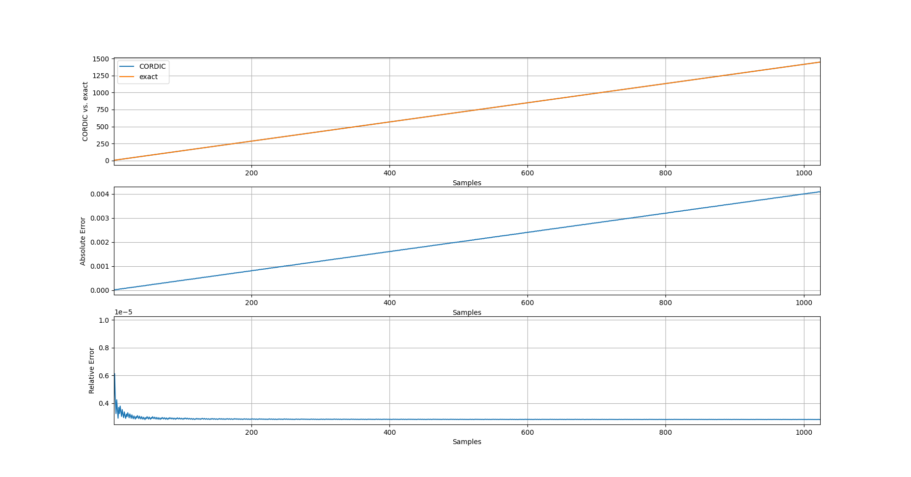

Fixed-Point CORDIC in SystemVerilog
===================================

Introduction
------------

The [CORDIC algorithm](https://en.wikipedia.org/wiki/CORDIC) can be used to compute
several functions. Among these functions is the square-root of the sum of two squares
as shown [here](https://www.mathworks.com/help/fixedpoint/ug/compute-square-root-using-cordic.html).
In this mode, CORDIC accepts two positive inputs: `x` and `y` and provides as a result:
  
  $$ \sqrt{x^2 + y^2} $$

This repository contains a synthesizable SystemVerilog implementation of the above CORDIC algorithm.
The design uses `Q16.F16` fixed-point format and is fully pipelined which allows it to
accept a new input every clock cycle.


Build Instructions
------------------

The makefile supports:

  - Basic linting and simulation using [Verilator](https://www.veripool.org/verilator/) (requires > v5.002)
  - Basic synthesis using [yosys](https://yosyshq.net/yosys/) (tested with v0.22)
  - Post-synthesis simulation using [iverilog](http://iverilog.icarus.com/)

To execute the makefile targets, just run:

  ```
  $ make sim    # for Simulation
  $ make lint   # for linting
  $ make synth  # for synthesis
  ```

Accuracy
--------

The accuracy of the implementation is verified using the `analyze_error.py` script.
The script parses the `cordic_results.csv` file generated by the testbench and calculates
the relative error and mean-square-error (MSE). It also plots the output from CORDIC vs.
the exact result as shown below:




